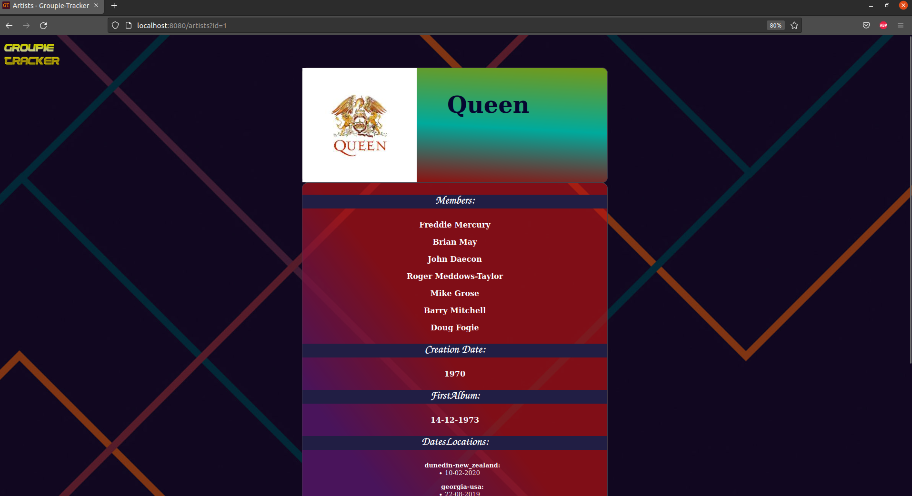

## Description
Groupie Trackers consists on receiving a given API and manipulate the data contained in it, in order to create a site, displaying the information.  
Subject from [01 School](https://github.com/01-edu/public/tree/master/subjects/groupie-tracker)  




## Usage: how to run?  
Clone this repository to your local machine. 
```shell
cd groupie-tracker

``` 
and type 

```shell
go run ./cmd/web
```  
Or you can specify port with flag `-addr`.  
Example: 
```shell 
go run ./cmd/web -addr=:4000
```  
After you can visit `http://localhost:$PORT`.

## Implementation  
There is [API](https://groupietrackers.herokuapp.com/api), which is parsed with json.Unmarshal and stored in Struct variable. Then content off that struct 
variable (artist's names and images) are printed on home page. Images are links as well. After user click on image, depending on image's id, that artist's 
page will be loaded. All of this information are printed via html templating. Project contains middleware for logging, panic recover and to set secure headers which are called on every request.
